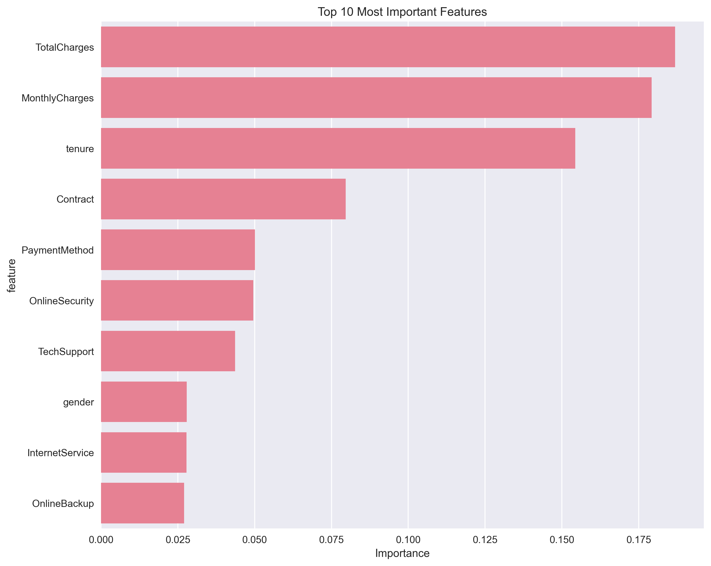
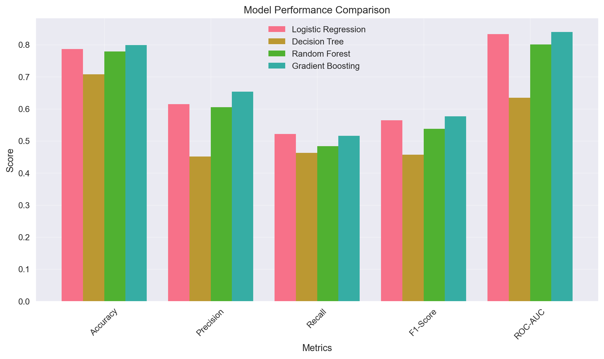
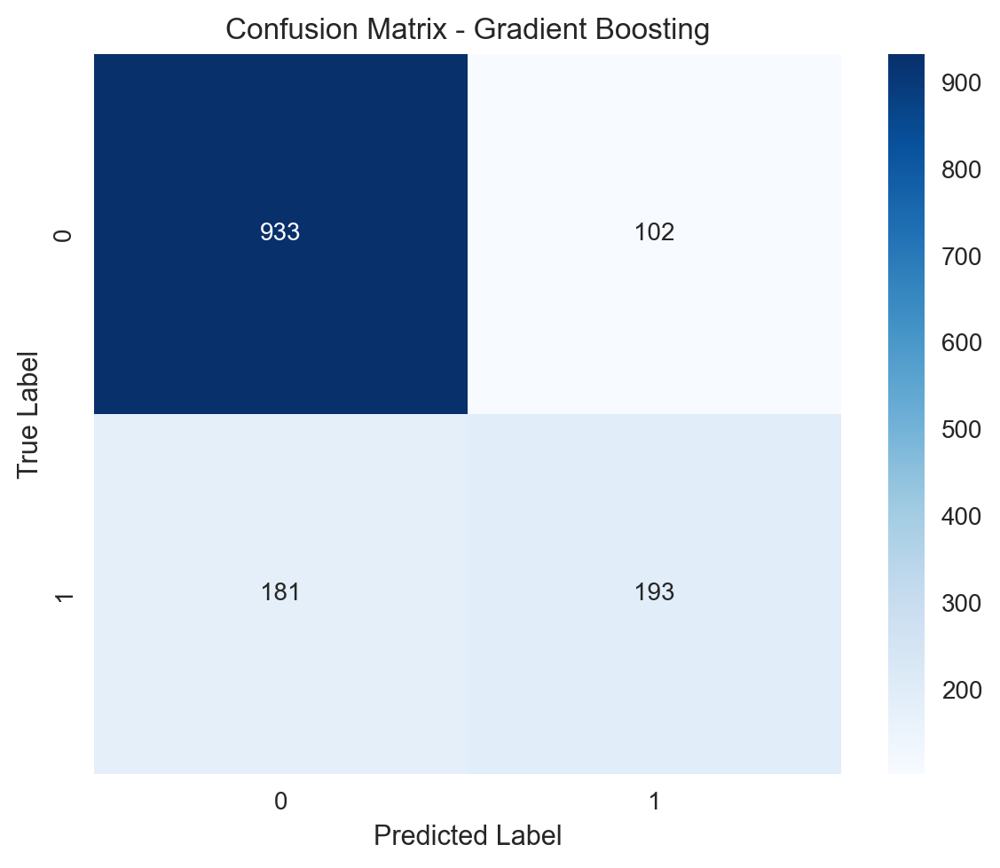
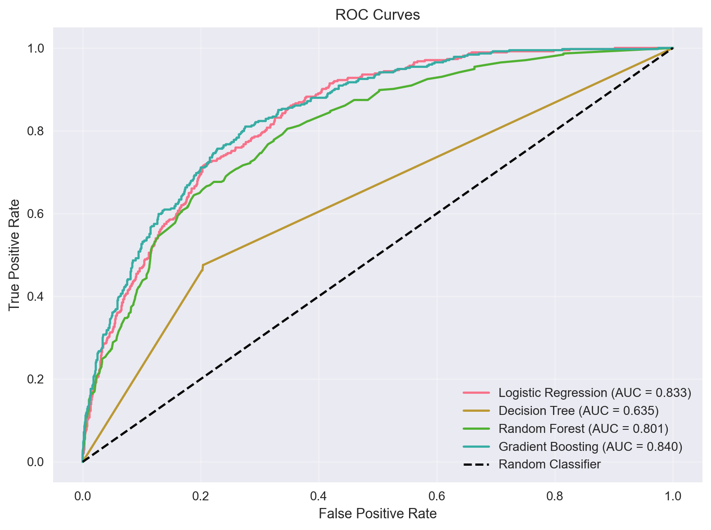
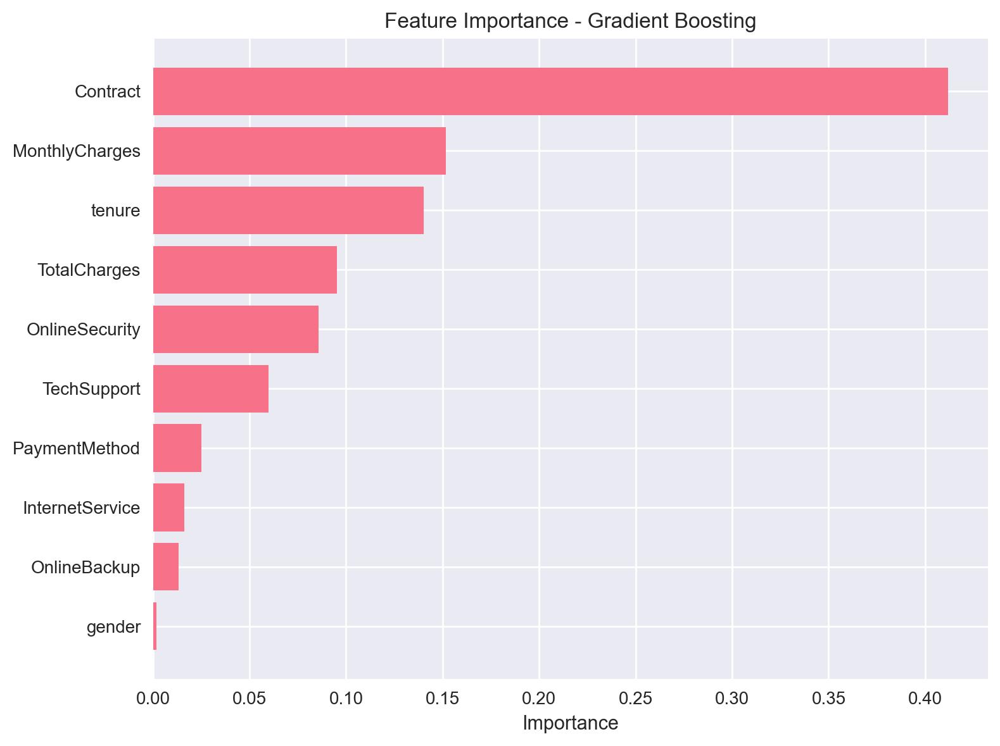
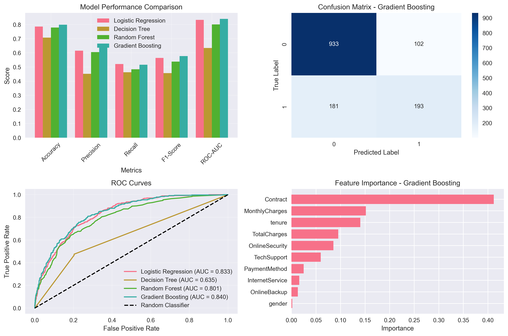

# Customer Churn Analysis and Prediction

This project analyzes customer churn data from a telecommunications company and builds predictive models to identify at-risk customers.

## **Quick Results Overview**

| Metric | Value |
|--------|-------|
| **Best Model** | Gradient Boosting |
| **F1-Score** | 0.5770 |
| **Accuracy** | 79.91% |
| **Churn Rate** | 26.54% |
| **Dataset Size** | 7,043 customers |

**Key Insight**: Month-to-month contract customers have a 42.7% churn rate, making them the highest risk segment.

## Project Overview

The project aims to:
- Analyze customer churn patterns
- Identify key factors influencing churn
- Build machine learning models to predict churn
- Provide actionable insights for customer retention

## Dataset

The dataset contains information about telecom customers including:
- Customer demographics (gender, age, partner, dependents)
- Account information (tenure, contract type, payment method)
- Services (phone, internet, streaming services)
- Charges (monthly and total charges)
- Churn status (target variable)

## Features

### Data Preparation
- Loads and preprocesses the dataset
- Handles missing values
- Encodes categorical variables
- Prepares data for machine learning

### Data Splitting
- Splits data into 80% training and 20% testing sets
- Ensures representative distribution of churn cases

### Feature Selection
- Identifies most important features using Random Forest
- Selects top 10 features for model training
- Provides feature importance visualization

### Model Selection & Training
- Tests multiple algorithms:
  - Logistic Regression
  - Decision Tree
  - Random Forest
  - Gradient Boosting
- Trains models on selected features

### Model Evaluation
- Comprehensive performance metrics:
  - Accuracy
  - Precision
  - Recall
  - F1-Score
  - ROC-AUC
- Confusion matrix analysis
- ROC curve visualization
- Model comparison charts

### Business Insights
- Analyzes churn patterns by contract type
- Examines tenure-based churn rates
- Provides actionable recommendations

## Installation

1. Install required packages:
```bash
pip install -r requirements.txt
```

## Usage

Run the complete analysis:
```bash
python customer_churn_analysis.py
```

The script will:
1. Load and preprocess the data
2. Split data into training/testing sets
3. Select important features
4. Train multiple models
5. Evaluate and compare models
6. Generate visualizations
7. Provide business insights

## Output

The script generates multiple visualization files:

### 📊 **Generated Visualizations**

#### 1. Feature Analysis
**Top 10 Most Important Features**

*Shows feature importance scores from Random Forest analysis to identify key factors driving customer churn*

#### 2. Model Performance Analysis

**Model Performance Comparison**

*Bar chart comparing all models across multiple metrics (Accuracy, Precision, Recall, F1-Score, and ROC-AUC)*

**Confusion Matrix - Best Model (Gradient Boosting)**

*Visual representation of true vs predicted classifications showing model performance on test data*

**ROC Curves Comparison**

*Compares model performance across different thresholds showing trade-off between true positive rate and false positive rate*

**Best Model Feature Importance**

*Shows which features the best model (Gradient Boosting) considers most important for decision-making*

#### 3. Legacy Visualization
**Combined Evaluation Dashboard**

*Multi-panel visualization with all evaluation metrics providing comprehensive overview of model performance*

### 📈 **Console Output**
- Detailed analysis results and metrics
- Business insights and recommendations
- Model performance statistics
- Data preprocessing information

### 🖼️ **Visual Gallery**

<div align="center">

| Feature Analysis | Model Performance |
|:---:|:---:|
|  |  |

| Confusion Matrix | ROC Curves |
|:---:|:---:|
|  |  |

| Best Model Features | Combined Dashboard |
|:---:|:---:|
|  |  |

</div>

### 📁 **Generated Files List**
```
best_model_features.png      (61KB)  - Best model feature importance
confusion_matrix.png         (44KB)  - Confusion matrix visualization  
feature_importance.png      (116KB)  - Top 10 feature importance
model_evaluation.png        (459KB)  - Legacy combined dashboard
model_performance.png        (75KB)  - Model comparison chart
roc_curves.png             (160KB)  - ROC curves comparison
```

## Key Findings

- **Best Model**: Gradient Boosting with F1-Score of 0.5770
- **Churn Rate**: 26.54% of customers churn
- **Key Risk Factors**:
  - Month-to-month contracts have the highest churn rate (42.7%)
  - Customers with tenure less than 12 months are at higher risk (47.7% churn rate)
  - High monthly charges correlate with increased churn
- **Top Important Features**:
  - TotalCharges (18.7% importance)
  - MonthlyCharges (17.9% importance) 
  - Tenure (15.4% importance)
  - Contract type (8.0% importance)


